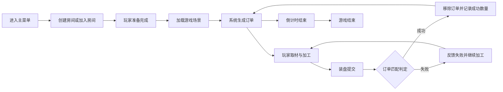
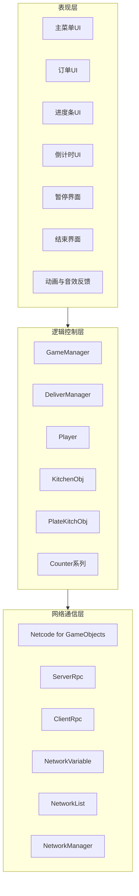
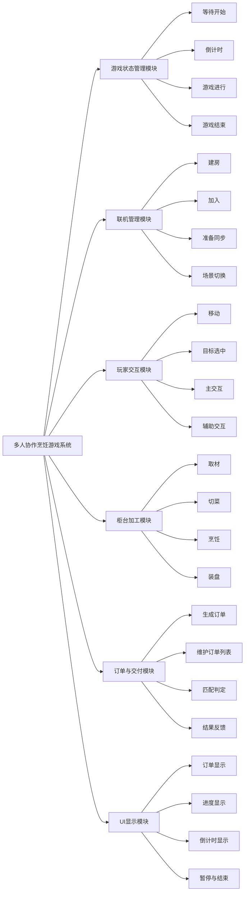
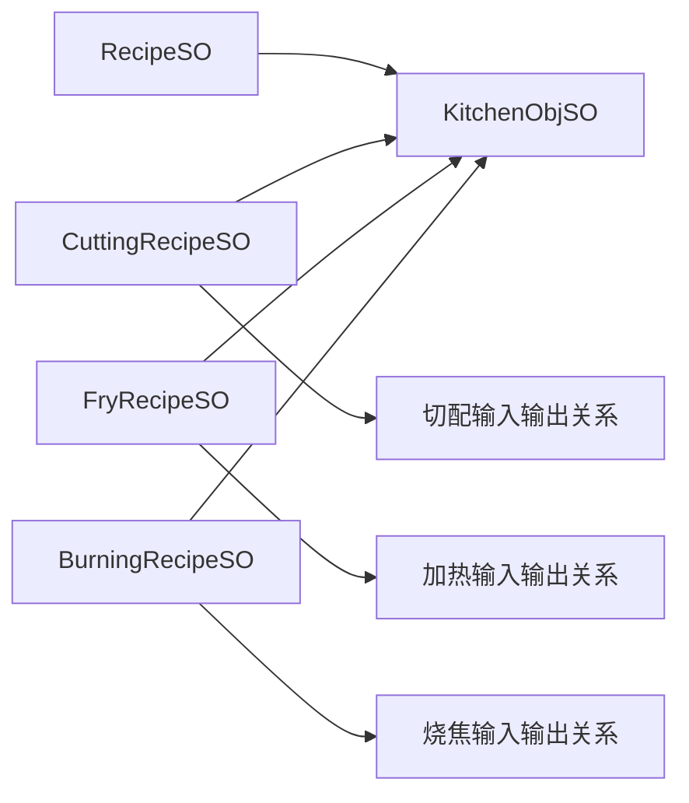
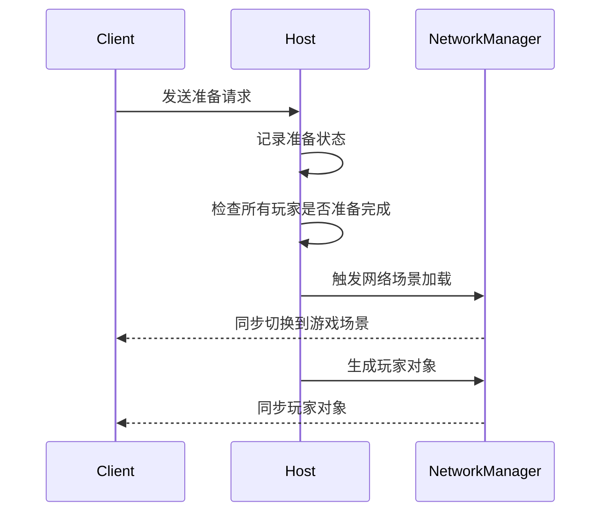
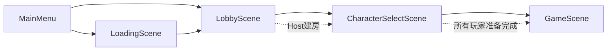
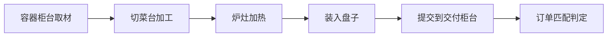
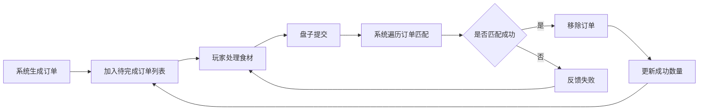

# Mermaid 图草稿

下面这些 Mermaid 草稿可以直接复制到支持 Mermaid 的网站或编辑器中继续调整。

---

## 图2-1 系统业务流程图

---

## 图3-1 系统总体架构图

---

## 图3-2 系统功能模块图

---

## 图3-3 数据驱动配置关系图

---

## 图3-4 玩家准备与场景切换时序图

---

## 图4-1 系统场景流转图

---

## 图4-2 食材加工流程图

---

## 图4-3 订单生成与交付判定流程图

